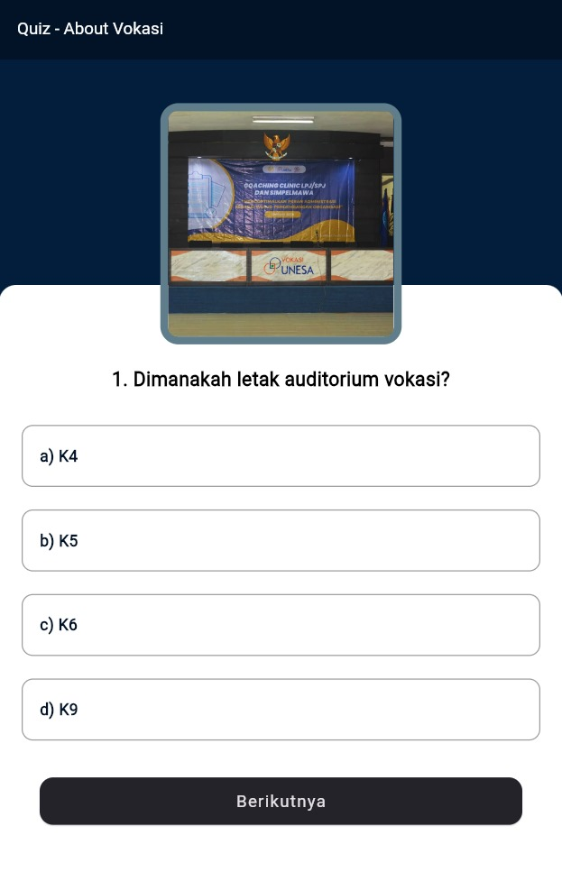
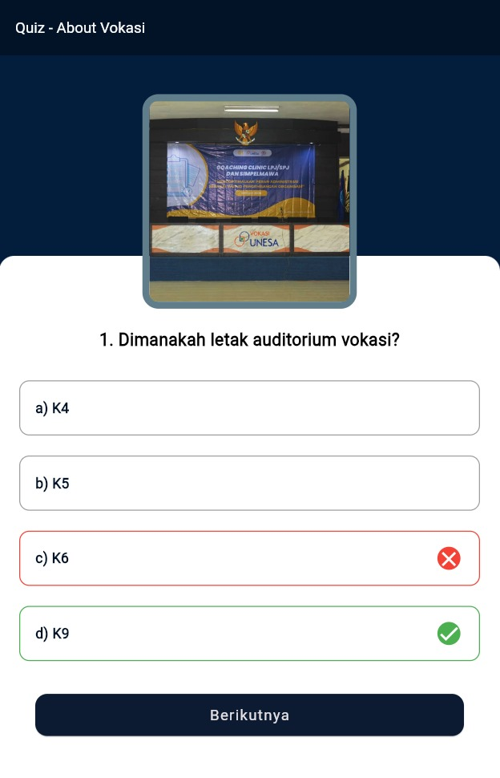
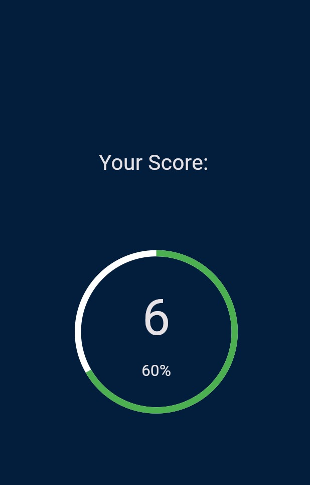

# Aplikasi Quiz - About Vokasi | Ujian Tengah Semester

 
 

 

> Project ini adalah Aplikasi Quiz Vokasi yang dirancang untuk menambah pengetahuan bagi mahasiswa baru tentang fakultas dan prodi D4 Manajemen Informatika.

## Fitur-Fitur:
- Pertanyaan
- Pilihan Jawaban
- Salah & Benar Jawaban
- Skor

## Preview
- Tampilan Quiz
  
  
  
  
- Tampilan Skor
  
  
  
  
  
